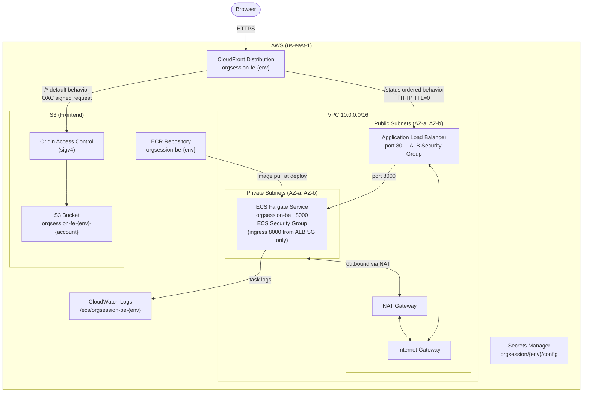
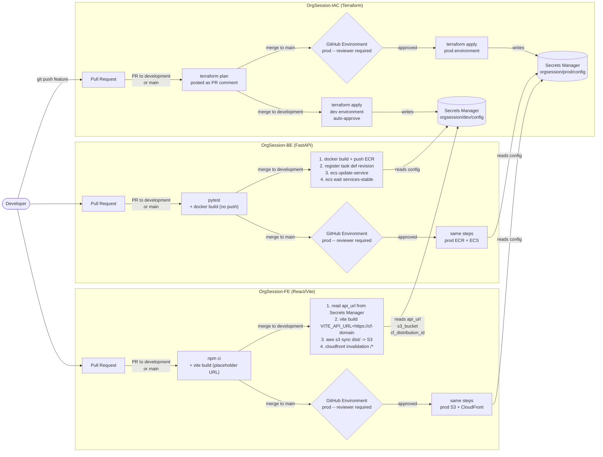
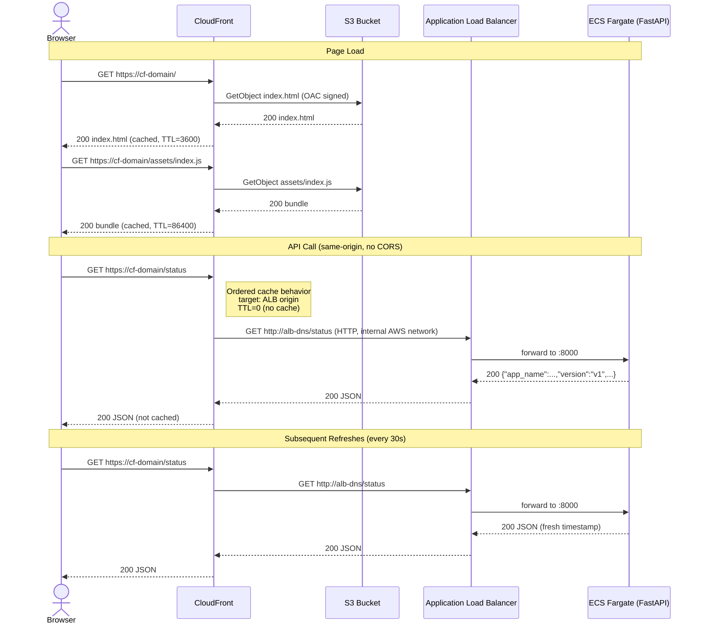

# OrgSession Architecture Diagrams

## 1. AWS Infrastructure

```mermaid
graph TB
    Browser(["Browser"])

    Browser -->|"HTTPS"| CF

    subgraph AWS["AWS (us-east-1)"]

        CF["CloudFront Distribution\norgsession-fe-{env}"]

        subgraph S3Block["S3 (Frontend)"]
            S3["S3 Bucket\norgsession-fe-{env}-{account}"]
            OAC["Origin Access Control\n(sigv4)"]
        end

        subgraph VPC["VPC  10.0.0.0/16"]

            subgraph Public["Public Subnets (AZ-a, AZ-b)"]
                IGW["Internet Gateway"]
                NAT["NAT Gateway"]
                ALB["Application Load Balancer\nport 80  |  ALB Security Group"]
            end

            subgraph Private["Private Subnets (AZ-a, AZ-b)"]
                ECS["ECS Fargate Service\norgsession-be  :8000\nECS Security Group\n(ingress 8000 from ALB SG only)"]
            end

        end

        ECR["ECR Repository\norgsession-be-{env}"]
        SM["Secrets Manager\norgsession/{env}/config"]
        CW["CloudWatch Logs\n/ecs/orgsession-be-{env}"]

    end

    CF -->|"/* default behavior\nOAC signed request"| OAC
    OAC --> S3
    CF -->|"/status ordered behavior\nHTTP  TTL=0"| ALB
    ALB -->|"port 8000"| ECS
    ECR -->|"image pull at deploy"| ECS
    ECS -->|"task logs"| CW
    IGW <--> ALB
    Private <-->|"outbound via NAT"| NAT
    NAT <--> IGW
```

---

## 2. CI/CD Pipeline Flow

```mermaid
graph LR
    Dev(["Developer"])

    Dev -->|"git push feature"| PR["Pull Request"]

    subgraph IAC["OrgSession-IAC  (Terraform)"]
        PR -->|"PR to development\nor main"| TFPlan["terraform plan\nposted as PR comment"]
        TFPlan -->|"merge to development"| TFApplyDev["terraform apply\ndev environment\nauto-approve"]
        TFPlan -->|"merge to main"| TFGate{"GitHub Environment\nprod -- reviewer required"}
        TFGate -->|"approved"| TFApplyProd["terraform apply\nprod environment"]
        TFApplyDev -->|"writes"| SM_IAC[("Secrets Manager\norgsession/dev/config")]
        TFApplyProd -->|"writes"| SM_IAC_P[("Secrets Manager\norgsession/prod/config")]
    end

    subgraph BE["OrgSession-BE  (FastAPI)"]
        PR2["Pull Request"] -->|"PR to development\nor main"| BEBuild["pytest\n+ docker build (no push)"]
        BEBuild -->|"merge to development"| BEDeploy["1. docker build + push ECR\n2. register task def revision\n3. ecs update-service\n4. ecs wait services-stable"]
        BEDeploy -->|"reads config"| SM_IAC
        BEBuild -->|"merge to main"| BEGate{"GitHub Environment\nprod -- reviewer required"}
        BEGate -->|"approved"| BEDeployProd["same steps\nprod ECR + ECS"]
        BEDeployProd -->|"reads config"| SM_IAC_P
    end

    subgraph FE["OrgSession-FE  (React/Vite)"]
        PR3["Pull Request"] -->|"PR to development\nor main"| FEBuild["npm ci\n+ vite build (placeholder URL)"]
        FEBuild -->|"merge to development"| FEDeploy["1. read api_url from Secrets Manager\n2. vite build VITE_API_URL=https://cf-domain\n3. aws s3 sync dist/ -> S3\n4. cloudfront invalidation /*"]
        FEDeploy -->|"reads api_url\ns3_bucket\ncf_distribution_id"| SM_IAC
        FEBuild -->|"merge to main"| FEGate{"GitHub Environment\nprod -- reviewer required"}
        FEGate -->|"approved"| FEDeployProd["same steps\nprod S3 + CloudFront"]
        FEDeployProd -->|"reads config"| SM_IAC_P
    end

    Dev --> PR2
    Dev --> PR3
```

---

## 3. Browser Request Flow

```mermaid
sequenceDiagram
    actor Browser
    participant CF as CloudFront
    participant S3 as S3 Bucket
    participant ALB as Application Load Balancer
    participant ECS as ECS Fargate (FastAPI)

    Note over Browser,ECS: Page Load

    Browser->>CF: GET https://cf-domain/
    CF->>S3: GetObject index.html (OAC signed)
    S3-->>CF: 200 index.html
    CF-->>Browser: 200 index.html (cached, TTL=3600)

    Browser->>CF: GET https://cf-domain/assets/index.js
    CF->>S3: GetObject assets/index.js
    S3-->>CF: 200 bundle
    CF-->>Browser: 200 bundle (cached, TTL=86400)

    Note over Browser,ECS: API Call (same-origin, no CORS)

    Browser->>CF: GET https://cf-domain/status
    Note right of CF: Ordered cache behavior<br/>target: ALB origin<br/>TTL=0 (no cache)
    CF->>ALB: GET http://alb-dns/status (HTTP, internal AWS network)
    ALB->>ECS: forward to :8000
    ECS-->>ALB: 200 {"app_name":...,"version":"v1",...}
    ALB-->>CF: 200 JSON
    CF-->>Browser: 200 JSON (not cached)

    Note over Browser,ECS: Subsequent Refreshes (every 30s)

    Browser->>CF: GET https://cf-domain/status
    CF->>ALB: GET http://alb-dns/status
    ALB->>ECS: forward to :8000
    ECS-->>ALB: 200 JSON (fresh timestamp)
    ALB-->>CF: 200 JSON
    CF-->>Browser: 200 JSON
```
